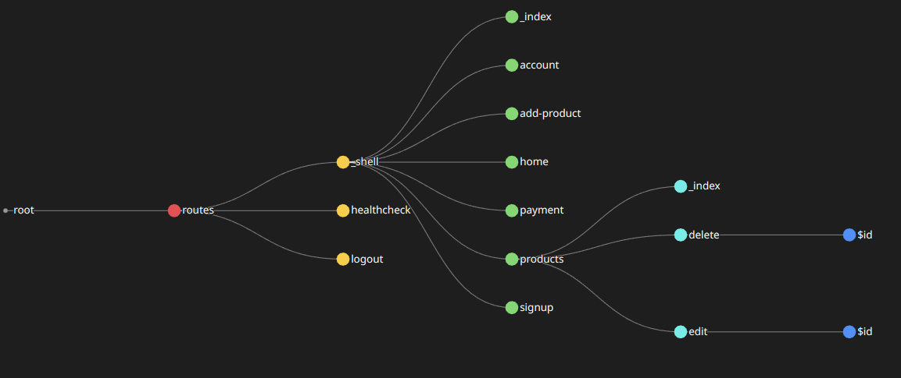

# Remix Template Starter

**Remix Template Starter** is designed to streamline your development process, enabling you to quickly launch highly effective web applications using the Remix full-stack framework. This template is a curated blend of application structures, dynamic UI components, and best practices in software engineering and web development workflows. It includes a range of functionality hooks, utilities, and seamless integration with key third-party services.

Powered by the following technologies:

Frontend:  


Backend:  


Others:  


# What is this template for

This template serves as a starting point for building your own application. You can customize and expand upon the existing components and features to fit your specific needs. It provides a foundation that you can build on top of, saving you time and effort in setting up the initial structure and common functionalities.

It's a collection of reusable components that you can copy and paste into your own projects. This approach gives you complete control over the code and allows you to modify and adapt the components to your specific requirements.

To use this template effectively, follow these steps:

1. Explore: Take some time to explore the template and understand its structure, components, and features. Familiarize yourself with the existing code and how it is organized.
2. Pick and Choose: Identify the components that are relevant to your project. Not every component may be necessary for your specific application. Select the ones that align with your needs.
3. Copy and Paste: Once you have identified the components you want to use, copy the corresponding code from the template and paste it into your own project. You can then customize and modify the code to match your application's design and functionality.
4. Customize and Expand: After integrating the components into your project, customize them to fit your specific requirements. Modify the styling, add additional features, or extend the functionality as needed. The code is now yours to adapt and build upon.
5. Use as a Reference: Even if you don't directly copy and paste the components, you can still use this template as a reference for building your own application. Study how the components are structured, how they interact with each other, and how common functionalities are implemented. Use this knowledge to create your own components and features.

Remember, this template is a starting kit, not a blank repository generator. It provides a foundation, but it's up to you to customize and shape it based on your actual application needs. Take the time to explore, understand, rename, and replace the contents as you build your application.

By leveraging the reusable components and following the provided structure, you can kickstart your development process and focus on implementing the unique aspects of your application. Feel free to modify, extend, and adapt the template to create a codebase that perfectly suits your project requirements.

This template can be used as a starting point, and be built on top of on, but can also be used to take the reusable components from this project, refer to the [components](#components) to see what can be taken and used in your own project.

# Live Preview

A live preview with the project deployed can be viewed [here](https://remix-template-starter.fly.dev/), it might take a while for the website to first load due to the VM sleeping (it only wakes up when someone is accessing the site, and sleeps after 10 minutes of inactivity).

You can either register a new account or log in using the following account:

Email:

```sh
test@test.com
```

Password:

```
test12345
```

Take into account that [adding a new product](./app/routes/_shell.add-product/route.tsx), [editing an existing product](./app/routes/_shell.products.edit.$id/route.tsx) and [deleting products](./app/routes/_shell.products.delete.$id/route.tsx) won't work. The APIs are protected by ensuring that only users with the `Administrator` role can modify them. If you enjoy the preview, then refer to the [next section](#getting-started) to get the project up and running on your own machine.

# Getting Started

These instructions will get you a copy of the project up and running on your local machine for development and testing purposes.

### Prerequisites

Before installing, ensure you have the following:

-   Node.js (version >=18.0.0 required)
-   npm or yarn installed

### Installation

You can choose from the following 2 options:

1. Clone the repository or set up using npx

Use the following command to clone the repository:

```sh
git clone https://github.com/aliabudal/Remix-Template-Starter.git
```

Use the following command to install using npx:

```sh
npx create-remix@latest --template aliabudal/Remix-Template-Starter
```

After cloning the repository or setting up the project using npx

2. Install the dependencies

Use the following command if you are using npm:

```sh
npm install
```

Use the following command if you are using yarn:

```
yarn install
```

3. Set up the environment variables

Refer to the [env-example.md](./env-example.md) file for the required environment variables. You need to create a `.env` file in the root directory of your project and add the variables mentioned there with the appropiate values. Make sure to replace the empty quotes with the actual values corresponding to your setup. The project by default uses [Turso](https://turso.tech/) for the database, if you want to use a different provider, you will have to modify the [server](./server.js) and [drizzle.config.ts](./drizzle.config.ts) with your desired config.

4. Build the project

Use the following command if you are using npm:

```sh
npm run build
```

Use the following command if you are using yarn:

```sh
yarn build
```

5. Start the server

Use the following command if you are using npm:

```sh
npm run dev
```

Use the following command if you are using yarn:

```sh
yarn dev
```

Now your project should be up and running, and you can access it in your browser at [localhost:3000](http://localhost:3000)

# Features

The Remix Template Starter comes with a set of pre-built [components](#components) and features to help you quickly develop your application. It also comes with [route protection](#protected-routes) via a parent route that acts as a wrapper around the other routes, ensuring that no unauthorized access is allowed to those routes. Linting and formatting with [Prettier](https://prettier.io/) and [ESLint](https://eslint.org/), hosting and auto-deployment with [Fly.io](https://fly.io/) and [GitHub](https://github.com/), refer to this [section](#nice-to-have-optional).

## Components

UI Components  
The [ui/](./app/components/ui/) directory contains a collection of reusable UI components that are taken from either [shadcn/ui](https://ui.shadcn.com/) or [Aceternity UI](https://ui.aceternity.com/). These components provide a consistent and stylish look and feel to your application. Some of the components may have undergone small modifications to fit the specific needs of this template.

The UI components include:

1. [accordion.tsx](./app/components/ui/accordion.tsx): An expandable content component
2. [badge.tsx](./app/components/ui/badge.tsx): A small badge component for displaying status or notifications
3. [button.tsx](./app/components/ui/button.tsx): Customizable button component
4. [card-hover-effect.tsx](./app/components/ui/card-hover-effect.tsx): A card component with hover effects
5. [card.tsx](./app/components/ui/card.tsx): A basic card component for displaying content
6. [dropdown-menu.tsx](./app/components/ui/dropdown-menu.tsx): A dropdown menu component
7. [input.tsx](./app/components/ui/input.tsx): An input field component
8. [label.tsx](./app/components/ui/label.tsx): A label component for form fields
9. [pagination.tsx](./app/components/ui/pagination.tsx): A pagination component for navigating through pages
10. [radio-group.tsx](./app/components/ui/radio-group.tsx): A radio button group component for selecting options
11. [select.tsx](./app/components/ui/select.tsx): A dropdown select component
12. [tabs.tsx](./app/components/ui/tabs.tsx): A tab navigation component

Other Components:  
The components located outside the ui/ directory are built using the logic and styling from the UI components, along with additional functionality and design specific to their purpose.

These components include:

1. [faq.tsx](./app/components/faq.tsx): A component for rendering frequently asked questions
2. [footer.tsx](./app/components/footer.tsx): The footer component of the application
3. [global-pending-indicator.tsx](./app/components/global-pending-indicator.tsx): A component for displaying a loading indicator
4. [header.tsx](./app/components/header.tsx): The header component of the application
5. [hero-section](./app/components/hero-section/): A directory containing components for the hero section
6. [how-it-works.tsx](./app/components/how-it-works.tsx): A component explaining how the application works
7. [icons.tsx](./app/components/icons.tsx): A collection of icon components
8. [payment.tsx](./app/components/payment.tsx): A component for handling payment functionality
9. [plans.tsx](./app/components/plans.tsx): A component for displaying available plans or pricing options
10. [theme-switcher.tsx](./app/components/theme-switcher.tsx): A component for switching between light and dark themes
11. [used-by-clients.tsx](./app/components/used-by-clients.tsx): A component showcasing the clients or companies using the application

These components are designed to work together seamlessly, providing a cohesive and functional user interface for your application.

## Protected routes

All essential routes are protected using the [\_shell route](./app/routes/_shell/route.tsx), this route acts as a parent route that wraps all the other routes in the application. It ensures that only authenticated users can access the protected routes. It also makes it so that the authentification is handled only 1 time throughout the entire application. The following image represents a representation of the routes:



Ensure that you define the directory inside the [routes/](./app/routes/) using the `_shell` syntax if you wish the route to be protected.

## Nice to have (optional)

This section explains some optional but beneficial features that are included in the template.

### Linting and Formatting

The template comes with [ESLint](https://eslint.org/) and [Prettier](https://prettier.io/) configured for linting and formatting your code, with the appropiate plugins for them (TailwindCSS, React etc).

Run the following command to format the entire project:

```sh
npm run format
```

Run the following command lint the entire project:

```sh
npm run lint
```

View all other commands or modify the existing commands in [package.json](./package.json).

### GitHub Actions Workflow

The template includes a GitHub Actions workflow configuration file that automatically checks for linting and formatting errors on pull requests and pushes to the master branch. It also deploys your application to [Fly.io](https://fly.io) when changes are pushed to the master branch.

The workflow consists of two jobs:

1. build: Runs on every pull request and push to the master branch. It checks out the code, sets up Node.js, installs dependencies, and runs ESLint and Prettier to check for linting and formatting errors.

2. deploy: Runs only on pushes to the master branch, after the build job has completed successfully. It checks out the code, installs the Flyctl CLI, and deploys the application to Fly.io using the provided FLY_API_TOKEN secret. 

If you want to remove either of those jobs, you can remove the job from the workflow configuration file at `.github/workflows/workflows.yaml`

**Important**: Make sure to set up the [FLY_API_TOKEN](https://fly.io/docs/reference/deploy-tokens/) secret in your GitHub repository's settings to enable automatic deployment to Fly.io.

These optional features help maintain code quality, consistency, and automated deployment, enhancing your development workflow.
